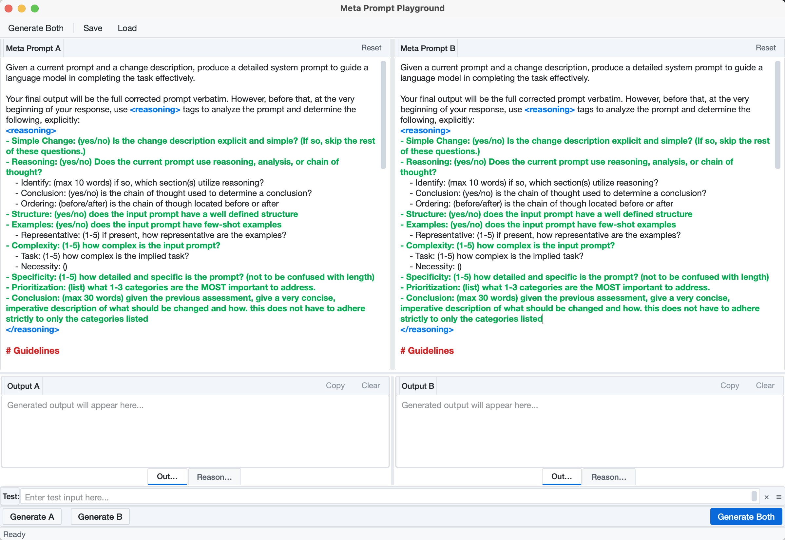

# Meta Prompt Playground

A tool for creating and comparing meta prompts in a side-by-side format.

## Overview

Meta Prompt Playground is a desktop application that allows you to:

- Edit and compare two different meta prompts side-by-side
- Generate and view outputs for each prompt
- View reasoning sections separately from the main output
- Save and load prompt sets for later use



## Features

- Side-by-side prompt editors with default meta prompt
- Output display areas for comparing results
- Separate reasoning display for <reasoning>...</reasoning> sections
- Save/load functionality for prompt sets
- Modern PyQt6-based user interface

## Installation

1. Clone this repository
2. Install the required dependencies:

```bash
pip install -r requirements.txt
```

3. Run the application:

```bash
python main.py
```

## Usage

1. **Editing Prompts**: The top section contains two side-by-side prompt editors.
   - Each editor comes pre-filled with the default meta prompt
   - Use the "Reset to Default" button to restore the original prompt

2. **Generating Outputs**: Use the buttons at the bottom to generate outputs.
   - "Generate A" - Generate output for the left prompt
   - "Generate B" - Generate output for the right prompt
   - "Generate Both" - Generate outputs for both prompts

3. **Viewing Outputs and Reasoning**: The bottom section contains tabbed views for each side.
   - "Output" tab - Shows the main output with any reasoning sections removed
   - "Reasoning" tab - Shows only the content of the <reasoning>...</reasoning> section
   - The application automatically switches to the Reasoning tab if reasoning is detected

4. **Saving/Loading**: Use the File menu or toolbar buttons to:
   - Save both prompts, outputs, and reasoning to a JSON file
   - Load previously saved prompt sets

## Command Line Interface

The application also supports a command-line interface for backwards compatibility:

```bash
python main.py --cli "Your prompt here"
```
